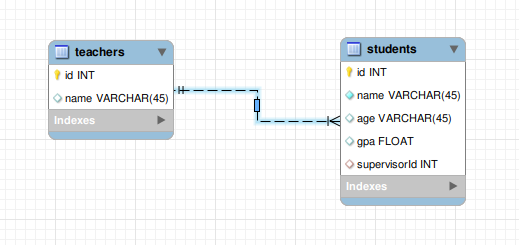

# Add functionality to map multiple fields in the return query result to a single typed record field

_Owners_: @daneshk @niveathika  
_Reviewers_: @daneshk  
_Created_: 2021/10/04  
_Updated_: 2021/10/05  
_Issues_: [#1924](https://github.com/ballerina-platform/ballerina-standard-library/issues/1924)

## Summary

Users can use this functionality to map multiple returned data columns to a single typed record field during the query operation. It is an n:1 mapping of the results through typed records.

## Goals

- Improve results type mapping to support n:1 mapping of results through typed records.

## Non-Goals

- This is not applied if the query operation returns an anonymous record.

## Motivation

This feature will be convenient when the user wants to return data from multiple tables with a single query.



In the above scenario, If I want to query both the Students and Teachers table. It would be convenient to group `TEACHERs.id` and `TEACHERS.name` into a typed record. It allows for easier manipulation of returned results.

## Description

This proposal is to support n:1 mapping from multiple return columns in the results to a Typed Record.

If the returned field name contains a period, the module will map it to an inner typed record field. The return type field must have the same name as the prefix of the return field.

Take the above example,


When the user executes the following query,
```ballerina
`SELECT * FROM students JOIN teachers ON students.supervisorId = teachers.id`. 
```

the returned results will include the following fields,

1. Id
2. name
3. age
4. gpa
5. supervisorId
6. TEACHERS.id
7. TEACHERS.name

Here the TEACHERS.id and TEACHERS.name fields contain a period. If the prefix(teachers) corresponds to a Typed Record field in the returned `Students` record as below,
```ballerina
public type Students record {|
 int id;
 string name;
 string? age;
 float? gpa;
 Teachers teachers;
|}
```
The module will map the id and name fields to the inner fields of the record teachers of the `Teachers` type.

Following scenarios are based on whether the Typed Record is an open record or a close record,

1. An Open Result Type description DOES NOT contain Typed Record Field with prefix name.
    ```ballerina
    public type Students record {
        int id;
        string name;
        string? age;
        float? gpa;
    }
    ```
    The module will use the column name to add additional fields.
    ```ballerina
    public type Students record {
        int id;
        string name;
        string? age;
        float? gpa;
        int TEACHERS.id;
        string TEACHERS.name;
    }
    ```
    > Note the above definition is for description purposes only. Since ballerina does not allow records to have fields with periods, the above code snippet is not compilable. However, users can access these fields with the map accessor as `student["TEACHERS.id"]`.

2. A Closed Result Type description DOES NOT contain Typed Record Field with prefix name.
    ```ballerina
    public type Students record {|
        int id;
        string name;
        string? age;
        float? gpa;
    |}
    ```
    As per the existing behaviour, the module will throw an error. Here the return type does not contain all columns returned.

3. Result Type description contains Typed Record Field with prefix name.
    ```ballerina
    public type Students record {|
        int id;
        string name;
        string? age;
        float? gpa;
        Teachers teachersந
    |}
    ```
    Regardless of the record type (open or close), the module will match the columns with the prefix to the teacher record fields. Here there are additional scenarios considering whether the Typed Record field is closed or not.
    - Close Record but DOES NOT contain the fields. The API will throw an error.
        ```ballerina 
        type Teachers record {|
            string name;
        |}
        ```
    - Close Record and contains correct fields as per the result column postfix. The module will map the fields correctly.
        ```ballerina
        type Teachers record {|
            int id;
            string name;
        |}
        ```
    - An Open Record. If the fields are not present, then the module will add the fields as per convention.
        ```ballerina
        type Teachers record {
            string name;
        }
        ```
        ```ballerina
        type Teachers record {
            int id;
            string name;
        }
        ```
